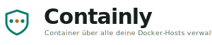

<p align="center">
  <picture>
    <source media="(prefers-color-scheme: dark)" srcset="Logos/containly-schild-lockup-dark.svg">
    
  </picture>
</p>

<h1 align="center">Containly</h1>

**A modern, secure, self-hosted Docker management web UI** — a Portainer
alternative without vendor lock-in. Stack definitions live as version-controllable
files on the filesystem, not in a database. Built for homelabs with multiple
Docker hosts behind a reverse proxy.

[](https://github.com/amslertec/containly/actions/workflows/ci.yml)
[](https://hub.docker.com/r/amslertec/containly)
[](LICENSE)

> ⚠️ **Security-critical.** Containly talks to the Docker socket — that is
> equivalent to root on the host. Read [Security](#security) before you expose it.

---

## Features

- **Containers** — list, detail/inspect, start/stop/restart/pause/kill/remove,
  **live logs**, **exec console** (in-browser terminal), **live resource stats**
  (CPU/RAM/net/IO).
- **Images** — list, pull, remove, prune (incl. unused tagged images), tag
  management, **update indicator**.
- **Volumes & networks** — list, create, remove, inspect, detect orphans.
- **Stacks** — Compose deployments kept as **files** (version-controllable, no DB
  lock-in). Per-endpoint stack paths, file browser with folder navigation, editor,
  "new file", **search** (stack/container/image), a **`docker run` →
  `docker-compose.yml` converter**, and stack-wide actions.
- **Multi-host** — multiple endpoints: local socket, TCP with TLS client
  certificates, SSH; an **"All hosts"** combined view. **Agent-less remote stack
  management** via a helper container (file CRUD + deploy over the plain Docker API).
- **Updates** — registry digest checks without pulling, background checking, and a
  **server-side bulk update job** (survives reloads) with live progress.
- **Registry login** — Docker Hub / registry sign-in (encrypted) for authenticated
  pulls & checks and private images.
- **Security** — Argon2id passwords, **two-factor authentication (TOTP + recovery
  codes)**, encrypted secrets at rest, audit log, CSRF, rate limiting.
- **Backup & restore** — passphrase-encrypted full backup for dev→prod migration.
- **i18n** — German & English; light/dark theme; role-based access (**admin/viewer**).

---

## Quick start (Docker Hub)

No clone needed — grab the example files from the public repo, rename them, edit,
and run:

```bash
mkdir containly && cd containly

# Download the example files straight to their final names:
curl -fsSL https://raw.githubusercontent.com/amslertec/containly/main/docker-compose.example.yml -o docker-compose.yml
curl -fsSL https://raw.githubusercontent.com/amslertec/containly/main/.env.example -o .env

# Edit docker-compose.yml — at minimum:
#   - the compose-projects volume mount (path on the host = path in the container)
#   - CONTAINLY_SECURE_COOKIES: true behind HTTPS, false for plain HTTP on the LAN
#   - the published port (127.0.0.1:8420 behind a proxy, or 0.0.0.0:8420 for direct LAN)

docker compose pull
docker compose up -d
docker compose logs -f containly   # copy the one-time setup token from the logs
```

On first start there is **no admin** yet. Containly prints a one-time **setup
token** to the logs (also in `data/setup.token`). Open the UI, enter the token, and
create the first administrator. After that, setup mode is closed permanently.

Containly listens on `127.0.0.1:8420` by default — put a reverse proxy
(Traefik/Caddy/nginx) with TLS in front of it.

### Hardening: filtered socket proxy (recommended)

Instead of mounting the socket directly, a **Docker socket proxy** can provide
filtered (least-privilege) access. Enable it with:

```bash
docker compose --profile hardened up -d
```

Then add a TCP endpoint on `socket-proxy:2375` in Containly (reachable only on the
internal Compose network — **never** expose plain 2375 externally). See
[SECURITY.md](SECURITY.md) for the full hardening plan.

---

## Architecture

```
containly/
├── shared/   @containly/shared  — Zod schemas = the API contract (front & back share types)
├── server/   @containly/server  — Fastify backend; the only thing that talks to Docker
│   ├── docker/     endpoint manager (dockerode) + container/resource operations
│   ├── routes/     REST endpoints (Zod-validated, auth/role-protected)
│   ├── ws/         WebSockets: logs / stats / exec
│   ├── services/   auth (Argon2id), sessions, users, audit, crypto, stacks, backup, registry
│   └── db/         SQLite (better-sqlite3) + migrations
└── web/      @containly/web     — React 19 + Vite + TanStack Query/Router, Tailwind, i18next
```

- **The Docker socket is never exposed to the frontend or the outside.** All Docker
  operations go through the authenticated backend API.
- **Shared Zod schemas** (`shared/`) are the single API contract — validated at
  every boundary, types shared by front and back.
- **Persistence:** SQLite for users, sessions, endpoint configs, registries and the
  audit log. Stacks live as files.

| Layer | Technology |
|---|---|
| Backend | Node 22, Fastify 5, dockerode, better-sqlite3, argon2, Zod |
| Frontend | React 19, TypeScript (strict), Vite, TanStack Query + Router, Tailwind CSS 4, Radix, i18next, xterm |
| Persistence | SQLite (users/sessions/endpoints/registries/audit) · Compose stacks as files |

---

## Development

```bash
npm install
npm run dev                 # backend (:8420) + Vite dev server in parallel
```

```bash
npm run typecheck           # tsc --strict across all workspaces
npm run lint                # typecheck + ESLint
npm run build               # production build (shared → server → web)
```

For local HTTP testing set `CONTAINLY_SECURE_COOKIES=false` in `.env`. All
environment variables are documented in [`.env.example`](.env.example). See
[CONTRIBUTING.md](CONTRIBUTING.md) for details.

---

## Security

Containly has **root-equivalent** access to every connected host. Highlights:

- Argon2id password hashing; **two-factor authentication** (TOTP + recovery codes).
- Session cookies (`HttpOnly`/`Secure`/`SameSite`) + CSRF tokens; login rate limiting.
- Endpoint TLS/SSH credentials and TOTP secrets **AES-256-GCM encrypted at rest**.
- Zod validation on every endpoint; path-traversal protection on stack files.
- Audit log for every mutation.

Read the full policy and hardening plan in **[SECURITY.md](SECURITY.md)**, and
report vulnerabilities privately (see that file) — not via public issues.

---

## License

[GNU AGPL-3.0](LICENSE). You run a root-equivalent tool — review the security
notes before exposing it. Provided without warranty.
