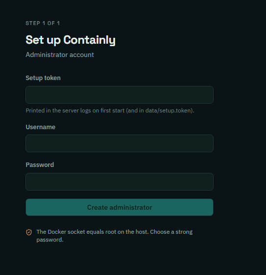
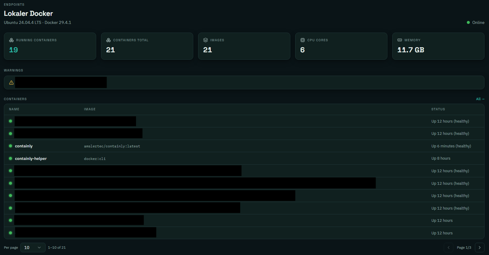
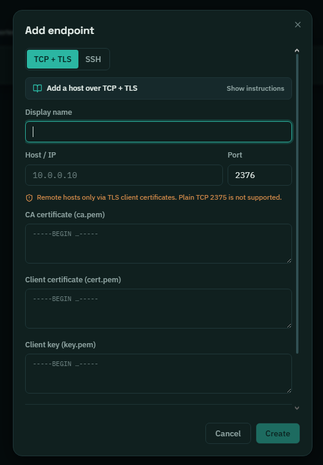

<p align="center">
  <picture>
    <source media="(prefers-color-scheme: dark)" srcset="Logos/containly-schild-teal-dark.svg">
    
  </picture>
</p>

<h1 align="center">Containly</h1>

**A modern, secure, self-hosted Docker management web UI** — no vendor lock-in.
Stack definitions live as version-controllable files on the filesystem, not in a
database. Built for homelabs with multiple Docker hosts behind a reverse proxy.

[](https://hub.docker.com/r/amslertec/containly)
[](https://containly.amslertec.ch)
[](LICENSE)

> ⚠️ **Security-critical.** Containly talks to the Docker socket — that is
> equivalent to root on the host. Read [Security](#security) before you expose it.

---

## Features

- **Containers** — list, detail/inspect, start/stop/restart/pause/kill/remove,
  **live logs**, **exec console** (in-browser terminal), **live resource stats**
  (CPU/RAM/net/IO).
- **Images** — list, pull, remove, prune (incl. unused tagged images), tag
  management, **update indicator**, and **CVE / vulnerability scanning** (Trivy) with
  severity badges.
- **Volumes & networks** — list, create, remove, inspect, detect orphans.
- **Stacks** — Compose deployments kept as **files** (version-controllable, no DB
  lock-in). Per-endpoint stack paths, file browser with folder navigation, editor,
  "new file", **search** (stack/container/image), a **`docker run` →
  `docker-compose.yml` converter**, GitOps auto-sync, and stack-wide actions.
- **Multi-host** — multiple endpoints: local socket, TCP with TLS client
  certificates, SSH; an **"All hosts"** combined view. **Agent-less remote stack
  management** via a helper container (file CRUD + deploy over the plain Docker API).
- **Live migration** — move a container or a whole Compose stack (with its image,
  volumes and networks) **between hosts**, streamed live with a progress log,
  pre-flight checks, and automatic rollback if anything fails.
- **Monitoring & alerts** — background watch for offline hosts, unhealthy containers,
  OOM kills, restart loops, low disk, image updates and new critical CVEs — notified
  in-app and by email.
- **Updates & self-update** — registry digest checks without pulling, semver detection for
  pinned version tags, a server-side **bulk update job** (survives reloads) with live progress,
  and **one-click self-update** where Containly recreates its own container and rolls back if
  the new version isn't healthy.
- **Scheduled tasks** — automate update checks, vulnerability scans, backups, pruning and
  auto-updates on an **hourly / per-weekday / monthly** schedule; every run is recorded in the
  audit log.
- **Registry login** — Docker Hub / registry sign-in (encrypted) for authenticated
  pulls & checks and private images.
- **Security** — Argon2id passwords, **two-factor authentication (TOTP + recovery
  codes)**, encrypted secrets at rest, audit log, CSRF, rate limiting.
- **Single sign-on** *(Pro)* — **Microsoft Entra ID SSO**: sign in with Microsoft accounts,
  Entra security groups mapped to admin/read-only roles, device-code login (plain HTTP, no
  domain) or seamless redirect, and a scheduled background role sync.
- **Appearance presets** *(Pro)* — give the instance its own look: curated colour &
  typography presets, or build your own from an accent, a font and per-mode background
  colours; the palette is derived contrast-safe for light & dark and applies to every user.
- **Backup & restore** — passphrase-encrypted full backup for dev→prod migration.
- **i18n** — German & English; light/dark theme; role-based access (**admin/viewer**).

---

## Pricing

Containly is **free for up to 2 Docker hosts** (the built-in local host plus one more) —
every feature included, no account, self-hosted. For **unlimited hosts**, a **Pro** license
is bought and activated directly inside the app (**Settings → License**):

| Plan | Price | Valid for | Free trial |
|---|---|---|---|
| **Lifetime** | CHF 189 one-time | 1 Containly instance | — |
| **Yearly** | CHF 89 / year | 1 Containly instance | 7 days |
| **Monthly** | CHF 15.90 / month | 2 Containly instances | 7 days |

A Pro license unlocks **unlimited hosts**, **Microsoft Entra ID single sign-on** and
**appearance presets**, works **offline** (7-day validation grace), and your data never
leaves your server. See the latest
pricing at
**[containly.amslertec.ch](https://containly.amslertec.ch)**.

---

## Quick start (Docker Hub)

No clone needed — grab the example files from the public repo, rename them, edit,
and run:

```bash
mkdir containly && cd containly

# Download the example files straight to their final names:
curl -fsSL https://raw.githubusercontent.com/amslertec/containly/main/docker-compose.example.yml -o docker-compose.yml
curl -fsSL https://raw.githubusercontent.com/amslertec/containly/main/.env.example -o .env

# All app config lives in .env (the compose file loads it via env_file). Edit .env —
# at minimum keep CONTAINLY_SECURE_COOKIES=false for plain HTTP (true only behind HTTPS).
# In docker-compose.yml, adjust the compose-projects volume mount
# (path on the host = path in the container).

docker compose pull
docker compose up -d
docker compose logs -f containly   # copy the one-time setup token from the logs
```

For production, put a reverse proxy (Traefik/Caddy/nginx) with TLS in front, set
`CONTAINLY_SECURE_COOKIES=true`, and bind the port locally (`127.0.0.1:8420`).

### First-time setup (create the admin)

On first start there is **no admin account** yet — Containly runs in *setup mode*
and prints a one-time **setup token** to the logs, inside a boxed banner:

```bash
docker compose logs containly
```

(The token is also stored in the `containly-data` volume at `/data/setup.token`.)

Then:

1. Open **`http://<server-ip>:8420`** in your browser — the setup form appears
   automatically while no admin exists.
2. Enter a **username**, a **password** (you can reveal it and must confirm it),
   and paste the **setup token**.
3. Submit → the first administrator is created, setup mode closes permanently, and
   the token is deleted.

> If the page is **blank/black**, you're reaching Containly over plain HTTP with
> `CONTAINLY_SECURE_COOKIES=true`. Set it to `false` (see `.env`), restart, and
> hard-refresh the browser (Ctrl+Shift+R).

## Screenshots

|  |  |
|---|---|
| **First-time setup** |  |
| **Dashboard** |  |
| **Endpoints** |  |

### Hardening: filtered socket proxy (recommended)

Instead of mounting the socket directly, a **Docker socket proxy** can provide
filtered (least-privilege) access. Enable it with:

```bash
docker compose --profile hardened up -d
```

Then add a TCP endpoint on `socket-proxy:2375` in Containly (reachable only on the
internal Compose network — **never** expose plain 2375 externally). See
[SECURITY.md](SECURITY.md) for the full hardening plan.

---

## Architecture

```
containly/
├── shared/   @containly/shared  — Zod schemas = the API contract (front & back share types)
├── server/   @containly/server  — Fastify backend; the only thing that talks to Docker
│   ├── docker/     endpoint manager (dockerode) + container/resource operations
│   ├── routes/     REST endpoints (Zod-validated, auth/role-protected)
│   ├── ws/         WebSockets: logs / stats / exec
│   ├── services/   auth (Argon2id), sessions, users, audit, crypto, stacks, backup, registry
│   └── db/         SQLite (better-sqlite3) + migrations
└── web/      @containly/web     — React 19 + Vite + TanStack Query/Router, Tailwind, i18next
```

- **The Docker socket is never exposed to the frontend or the outside.** All Docker
  operations go through the authenticated backend API.
- **Shared Zod schemas** (`shared/`) are the single API contract — validated at
  every boundary, types shared by front and back.
- **Persistence:** SQLite for users, sessions, endpoint configs, registries and the
  audit log. Stacks live as files.

| Layer | Technology |
|---|---|
| Backend | Node 22, Fastify 5, dockerode, better-sqlite3, argon2, Zod |
| Frontend | React 19, TypeScript (strict), Vite, TanStack Query + Router, Tailwind CSS 4, Radix, i18next, xterm |
| Persistence | SQLite (users/sessions/endpoints/registries/audit) · Compose stacks as files |

---

## Security

Containly has **root-equivalent** access to every connected host. Highlights:

- Argon2id password hashing; **two-factor authentication** (TOTP + recovery codes).
- Session cookies (`HttpOnly`/`Secure`/`SameSite`) + CSRF tokens; login rate limiting.
- Endpoint TLS/SSH credentials and TOTP secrets **AES-256-GCM encrypted at rest**.
- Zod validation on every endpoint; path-traversal protection on stack files.
- Audit log for every mutation.

Read the full policy and hardening plan in **[SECURITY.md](SECURITY.md)**, and
report vulnerabilities privately (see that file) — not via public issues.

---

## License

[GNU AGPL-3.0](LICENSE). You run a root-equivalent tool — review the security
notes before exposing it. Provided without warranty.
