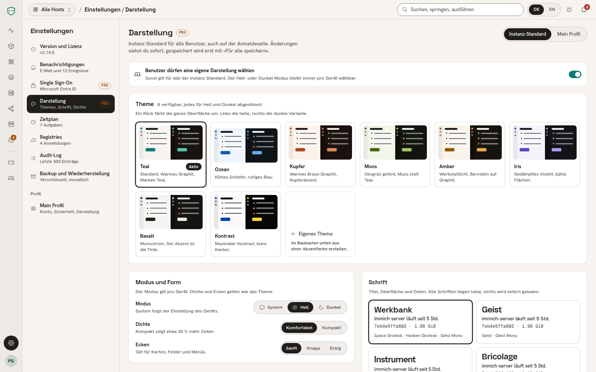

<p align="center">
  <picture>
    <source media="(prefers-color-scheme: dark)" srcset="Logos/containly-schild-teal-dark.svg">
    
  </picture>
</p>

<h1 align="center">Containly</h1>

<p align="center">
  A self-hosted web UI for running Docker across several hosts.<br>
  Compose stacks stay plain files on disk. One instance, every host, one place to look.
</p>

<p align="center">
  <a href="https://hub.docker.com/r/amslertec/containly"></a>
  <a href="https://containly.ch"></a>
  <a href="LICENSE"></a>
</p>

<p align="center">
  
</p>

Containly is built for homelabs and small fleets: a few Docker hosts at home, a NAS, a
VPS or two, usually behind a reverse proxy. It shows what needs attention first, lets you
act on it in one click, and keeps your Compose files where they belong: in folders you can
version, back up and edit without Containly.

> **Security-critical.** Containly talks to the Docker socket, which is equivalent to root
> on the host. Read [Security](#security) before you expose it.

---

## Features

### Dashboard

- **Status line.** One sentence that says how things are: hosts online, containers that
  need you, pending updates, restarts today. Below it the key numbers for all hosts.
- **Timeline.** The state of every host and stack over the last 24 h (or 6 h, 12 h,
  7 days), with outages, restarts, deploys and updates marked on one time axis.
- **Attention queue.** Offline hosts, unhealthy or crashed containers, available updates
  and images with critical CVEs, each with the action that fixes it (re-check, restart,
  start, update all, open).
- **Host matrix.** Every host in one table: status, Docker version, containers, images,
  CPU, RAM and disk with a 24 h CPU trend, updates and CVEs per host.
- **Live events.** A running feed of container, image, update and sign-in events, with a
  filter for warnings. Plus the containers with the most restarts.

### Containers

- **Workbench layout.** The list stays on the left, the selected container opens in an
  inspector on the right. Filter by state, search by name, image or ID, sort, favourite,
  select several for bulk start, stop, restart or remove.
- **Inspector tabs.** Overview (CPU and memory trend, restart policy, health check,
  ports and networks, mounts), **Logs**, **Stats**, **Console**, **Environment**, **Files**
  and raw **Inspect**.
- **Logs.** Live stream with tail length, search, timestamps, wrap, follow and download.
- **Stats.** Live CPU, memory, network and block I/O, plus history for 1 h, 6 h, 24 h and
  7 days that survives container recreation.
- **Console.** An in-browser shell (bash, ash, sh or a custom path) for admins.
- **Environment and files.** Edit environment variables with secrets masked, browse,
  upload, download and delete files inside a running container.
- Published ports link straight to the service. Pause, kill and migrate are one menu away.

### Stacks

- **Compose as files.** Stacks live in folders on each host's stack paths: versionable,
  no database lock-in. Compose projects started outside Containly are found through their
  Compose labels and shown alongside.
- **Compose editor.** Line numbers, file tree with `.env` and extra files, new file,
  unsaved changes marker.
- **Diff before deploy.** See exactly what changes on disk before you redeploy. Deploy,
  start, stop, restart and down stream their output live.
- **Git stacks.** Clone a stack from a public or private repository (access token),
  optional auto-sync on a schedule, sync status per stack.
- A `docker run` to `docker-compose.yml` converter, archive and restore, and stack-wide
  actions.

### Images, volumes, networks

- **Images.** Pull with Docker Hub search and tag picker, tag, remove, prune unused,
  layer view, update badges.
- **CVE scanning.** Trivy scans your images on demand or on a schedule. Severity counts
  in the list, and per image
  the full list of CVEs with package, installed version and fixed version.
- **Volumes.** Create, remove, prune, find orphans, and browse a volume's files with
  upload and download.
- **Networks.** Create bridge, macvlan, ipvlan or overlay networks (optionally internal),
  remove, prune, find orphans. System networks are protected.

### App catalog and updates

- **App catalog.** Browse templates, add your own template sources, deploy an app as a
  stack with its environment variables filled in.
- **Updates.** Registry digest checks without pulling, semver detection for pinned version
  tags, a server-side bulk update job with live progress that survives reloads.
- **Self-update.** Containly recreates its own container in one click and rolls back if the
  new version is not healthy.
- **Registry logins.** Several Docker Hub or private registry accounts, encrypted; the
  right account is picked per image namespace.

### Endpoints

- **Every way to connect.** The local socket, **TCP with TLS** client certificates,
  **SSH**, or the **agent**: a hardened `containly-agent` container that dials out to
  Containly over WSS, so the host needs no open Docker port or SSH and can sit behind NAT.
  Enrol with a one-time token and a copy-paste `docker run` or Compose snippet.
- **Host pages.** Per host: status, resources over the last 24 h, what needs attention,
  system details, containers and stack paths.
- **Agent-less remote stacks.** Manage Compose files on TCP and SSH hosts through a small
  helper container over the plain Docker API.
- **Live migration.** Move a container or a whole Compose stack, with its image, volumes
  and networks, to another host. Pre-flight checks, a live progress log and automatic
  rollback if anything fails.

### Administration

- **Users and roles.** Admin and viewer roles, invitations by email, admin-initiated
  password reset links, active sessions you can revoke.
- **Single sign-on** *(Pro)*. Microsoft Entra ID: sign in with Microsoft accounts, Entra
  groups mapped to roles, device-code login (works on plain HTTP without a domain) or
  redirect, and a scheduled role sync.
- **Two-factor authentication.** TOTP with recovery codes.
- **Audit log.** Every change, with user, target, outcome and IP.
- **Backups.** Passphrase-encrypted full backup and restore, also on a schedule.
- **Notifications.** In-app feed and email (SMTP) for offline hosts, crashed, unhealthy or
  OOM-killed containers, restart loops, CPU, memory and disk thresholds, image and
  Containly updates, and new critical CVEs. Recipients per event type.
- **Schedules.** Update checks, vulnerability scans, backups, image and volume pruning,
  auto-updates and SSO sync, hourly, on chosen weekdays or monthly. Every run lands in the
  audit log.

### Appearance

- **Light and dark.** Follow the system or pick a mode, per device.
- **Eight themes** *(Pro)*, each tuned for both light and dark, plus **custom themes**
  built from an accent colour.
- **Per-user override** *(Pro)*. Admins set the instance default; users may pick their
  own theme, font and density if the admin allows it.
- **Density and fonts.** Comfortable or compact rows, corner style, and four font
  pairings. All fonts are self-hosted; nothing loads from a third party.

### Keyboard, mobile, languages

- **Keyboard-first.** `Ctrl`/`Cmd` + `K` opens the command palette for pages, hosts,
  containers and images. In lists, `j` and `k` move, `Enter` opens the inspector, `Esc`
  closes it, `/` searches, and `g` then `d` or `c` jumps to the dashboard or containers.
- **Mobile and PWA.** A phone layout with bottom navigation and pull to refresh.
  Install Containly as an app on your phone or desktop.
- **Languages.** English and German.

---

## Screenshots

| Dashboard, light | Containers with inspector |
|---|---|
|  |  |
| **Container logs** | **Stack with compose editor** |
|  |  |
| **Image CVEs** | **Host page** |
|  |  |
| **Appearance and themes** | **Sign-in** |
|  |  |

<p align="center">
  
  &nbsp;&nbsp;
  
</p>

---

## Pricing

Containly is **free for up to 2 Docker hosts** (the built-in local host plus one more),
with every core feature included, no account, self-hosted. For **unlimited hosts**, a
**Pro** license is bought and activated directly inside the app (**Settings > License**):

| Plan | Price | Valid for | Free trial |
|---|---|---|---|
| **Lifetime** | CHF 189 one-time | 1 Containly instance | none |
| **Yearly** | CHF 89 / year | 1 Containly instance | 7 days |
| **Monthly** | CHF 15.90 / month | 2 Containly instances | 7 days |

A Pro license unlocks **unlimited hosts**, **Microsoft Entra ID single sign-on** and
**themes and appearance**, works **offline** (7-day validation grace), and your data never
leaves your server. Current pricing is on **[containly.ch](https://containly.ch)**.

---

## Quick start (Docker Hub)

No clone needed. Grab the example files from this repo, edit, and run:

```bash
mkdir containly && cd containly

# Download the example files straight to their final names:
curl -fsSL https://raw.githubusercontent.com/amslertec/containly/main/docker-compose.example.yml -o docker-compose.yml
curl -fsSL https://raw.githubusercontent.com/amslertec/containly/main/.env.example -o .env

# All app config lives in .env (the compose file loads it via env_file). Edit .env:
# at minimum keep CONTAINLY_SECURE_COOKIES=false for plain HTTP (true only behind HTTPS).
# In docker-compose.yml, adjust the compose-projects volume mount
# (path on the host = path in the container).

docker compose pull
docker compose up -d
docker compose logs -f containly   # copy the one-time setup token from the logs
```

For production, put a reverse proxy (Traefik, Caddy, nginx) with TLS in front, set
`CONTAINLY_SECURE_COOKIES=true`, and bind the port locally (`127.0.0.1:8420`).

### First-time setup (create the admin)

On first start there is **no admin account** yet. Containly runs in *setup mode* and
prints a one-time **setup token** to the logs, inside a boxed banner:

```bash
docker compose logs containly
```

(The token is also stored in the `containly-data` volume at `/data/setup.token`.)

Then:

1. Open **`http://<server-ip>:8420`** in your browser. The setup form appears
   automatically while no admin exists.
2. Enter a **username**, a **password** (you can reveal it and must confirm it), and
   paste the **setup token**.
3. Submit. The first administrator is created, setup mode closes permanently, and the
   token is deleted.

> If the page is **blank or black**, you are reaching Containly over plain HTTP with
> `CONTAINLY_SECURE_COOKIES=true`. Set it to `false` (see `.env`), restart, and
> hard-refresh the browser (Ctrl+Shift+R).

### Hardening: filtered socket proxy (recommended)

Instead of mounting the socket directly, a **Docker socket proxy** can provide filtered
(least-privilege) access. Enable it with:

```bash
docker compose --profile hardened up -d
```

Then add a TCP endpoint on `socket-proxy:2375` in Containly (reachable only on the
internal Compose network; **never** expose plain 2375 externally). See
[SECURITY.md](SECURITY.md) for the full hardening plan.

---

## Architecture

```
containly/
├── shared/   @containly/shared  Zod schemas = the API contract (front and back share types)
├── server/   @containly/server  Fastify backend; the only thing that talks to Docker
│   ├── docker/     endpoint manager (dockerode) + container/resource operations
│   ├── routes/     REST endpoints (Zod-validated, auth/role-protected)
│   ├── ws/         WebSockets: logs / stats / exec
│   ├── services/   auth (Argon2id), sessions, users, audit, crypto, stacks, backup, registry
│   └── db/         SQLite (better-sqlite3) + migrations
└── web/      @containly/web     React 19 + Vite + TanStack Query/Router, Tailwind, i18next
```

- **The Docker socket is never exposed to the frontend or the outside.** All Docker
  operations go through the authenticated backend API.
- **Shared Zod schemas** (`shared/`) are the single API contract, validated at every
  boundary, with types shared by front and back.
- **Persistence:** SQLite for users, sessions, endpoint configs, registries and the audit
  log. Stacks live as files.

| Layer | Technology |
|---|---|
| Backend | Node 22, Fastify 5, dockerode, better-sqlite3, argon2, Zod |
| Frontend | React 19, TypeScript (strict), Vite, TanStack Query + Router, Tailwind CSS 4, Radix, i18next, xterm |
| Persistence | SQLite (users, sessions, endpoints, registries, audit) and Compose stacks as files |

---

## Security

Containly has **root-equivalent** access to every connected host. Highlights:

- Argon2id password hashing; **two-factor authentication** (TOTP and recovery codes).
- Session cookies (`HttpOnly`, `Secure`, `SameSite`) and CSRF tokens; login rate limiting.
- Endpoint TLS and SSH credentials and TOTP secrets **AES-256-GCM encrypted at rest**.
- Zod validation on every endpoint; path-traversal protection on stack files.
- Audit log for every mutation.

Read the full policy and hardening plan in **[SECURITY.md](SECURITY.md)**, and report
vulnerabilities privately (see that file), not via public issues.

---

## License

[GNU AGPL-3.0](LICENSE). You run a root-equivalent tool; review the security notes before
exposing it. Provided without warranty.
